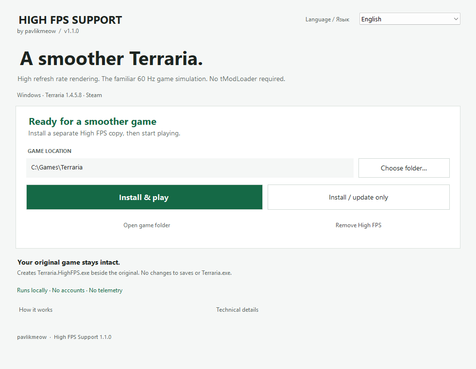

# High FPS Support

A launcher that makes movement in Terraria smoother on high refresh rate displays. Players, enemies, projectiles and dropped items are drawn between the game's usual 60 updates per second. Game speed stays the same.

**Version 1.1.0 · Steam Terraria 1.4.5.8 · Windows x86**

**English** · [Русский](docs/README.ru.md) · [Deutsch](docs/README.de.md) · [Español](docs/README.es.md) · [Français](docs/README.fr.md) · [Português (Brasil)](docs/README.pt-BR.md) · [简体中文](docs/README.zh-CN.md)



## Install and play

You need the original Steam Terraria 1.4.5.8 for Windows, .NET Framework 4.x and XNA Framework 4. Run Terraria through Steam once to finish installing its prerequisites. Other game versions, tModLoader and other executable patches are not supported.

1. Download `HighFPS-Support-1.1.0-Terraria-1.4.5.8-win-x86.zip` from [Releases](https://github.com/Pavlikmeow/terraria-high-fps/releases) and extract the entire archive.
2. Close Terraria and leave Steam running.
3. Open `HighFpsSupport.exe`, choose your language and check the detected game folder. It should contain `Terraria.exe` and `Content`.
4. Click **Install & play**. Next time, use **Play**.

The mod uses your normal Terraria saves, so back up important worlds and characters before trying it. It creates a separate `Terraria.HighFPS.exe`; the original `Terraria.exe` stays unchanged. Launching through Steam still opens the original game.

The mod sets **Frame Skip: Off**. Check your display's refresh rate in Windows too. Extra frames need spare CPU/GPU capacity; this does not make a slow simulation run faster. Interpolation can add up to one tick of visual delay, and does not smooth every animation or effect.

**Update or repair:** close the game, extract the new release into a fresh folder and choose **Install / update only**. After a Terraria update, check that the mod supports the new game version.

**Uninstall:** close the game and choose **Remove High FPS**. Your original game and saves remain. See the [guide](docs/guide.md) for manual removal and troubleshooting.

## Check your download

Compare the archive's SHA-256 with the [release checksums](docs/release-hashes.md) for the same version:

```powershell
Get-FileHash -Algorithm SHA256 -LiteralPath .\HighFPS-Support-1.1.0-Terraria-1.4.5.8-win-x86.zip
```

The ZIP includes `SHA256SUMS.txt` and a script to verify its contents. From the extracted folder:

```powershell
powershell -NoProfile -File .\verify-release.ps1
```

If scripts are blocked, use `Get-FileHash` to compare files with `SHA256SUMS.txt`. Do not run files whose hashes differ. Builds are unsigned, so Windows may show an unknown publisher. Checksums detect changed files; they are not a security audit. See [Security](SECURITY.md) for details and vulnerability reporting.

## Development

The launcher uses Mono.Cecil to add three calls around Terraria's update and draw routines. The runtime captures positions before a tick, interpolates them during drawing and restores them afterwards. The launcher has no telemetry, automatic updates or runtime downloads.

- [Build and test](docs/building.md)
- [How interpolation works](docs/architecture.md)
- [Contributing](CONTRIBUTING.md)
- [Verification for 1.1.0](docs/verification.md)

## Credits and license

By **pavlikmeow**. Project code and documentation use the [MIT license](LICENSE). [Mono.Cecil](https://github.com/jbevain/cecil) has its own MIT notice. Thanks to [TerrariaHighFPS](https://github.com/Yukurotei/TerrariaHighFPS) for the interpolation approach. See [third-party notices](THIRD-PARTY-NOTICES.md) for attribution and license scope.

This is an unofficial fan project, unaffiliated with Re-Logic, Valve or Microsoft. Terraria and its assets are not included; you need your own copy of the game.
