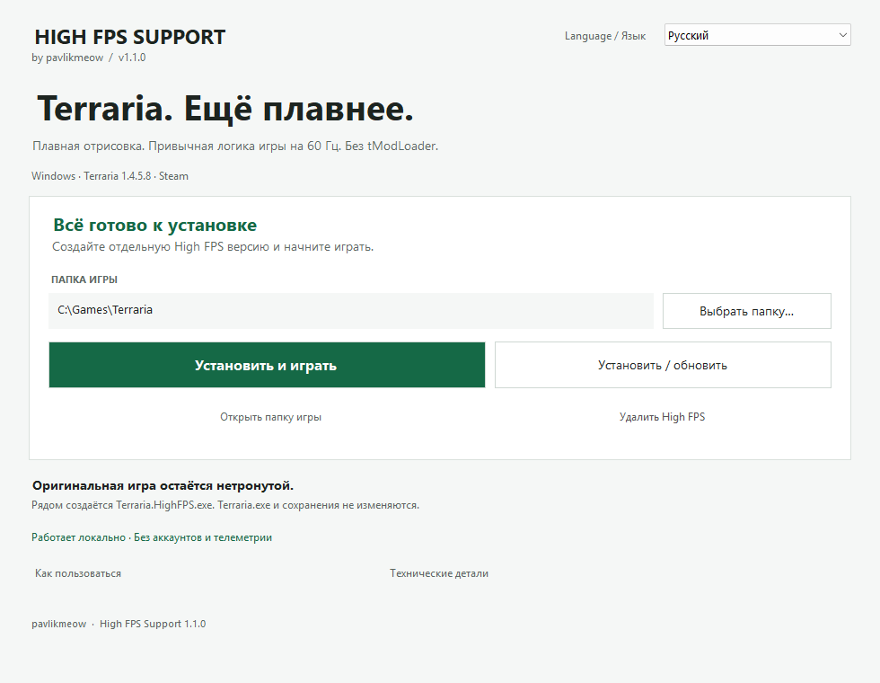

# High FPS Support

**Более плавное движение в Terraria — с частотой вашего монитора.**  
Неофициальный лаунчер с открытым кодом от **pavlikmeow** · Версия **1.1.0**

[English](../README.md) · **Русский** · [Deutsch](README.de.md) · [Español](README.es.md) · [Français](README.fr.md) · [Português (Brasil)](README.pt-BR.md) · [简体中文](README.zh-CN.md)

Terraria обновляет игровой мир 60 раз в секунду. High FPS Support рисует движение между этими обновлениями: персонажи, враги, снаряды и выпавшие предметы выглядят плавнее на мониторах 120/144/165/240 Гц. Скорость игры остаётся прежней. tModLoader не нужен.



## Перед запуском

| Требование | Поддерживается |
| --- | --- |
| Игра | **Steam Terraria 1.4.5.8**, оригинальный Windows x86 EXE |
| Система | Windows с установленными .NET Framework 4.x и XNA Framework 4 |
| Монитор | Любой; выше 60 Гц разница наиболее заметна |
| Другие версии и платформы | Не поддерживаются этой сборкой; tModLoader и другие патчи EXE не поддерживаются |

Нужна собственная лицензионная копия Terraria. Один раз запустите обычную игру через Steam, чтобы установились её компоненты. Перед использованием любого мода сохраните резервную копию важных миров и персонажей: здесь используются обычные сохранения Terraria.

## Запуск за минуту

1. Откройте раздел **Releases** этого репозитория. Скачайте `HighFPS-Support-1.1.0-Terraria-1.4.5.8-win-x86.zip` и **полностью распакуйте архив** в доступную вам папку. Не запускайте программу внутри ZIP и не переносите отдельно только EXE.
2. [Проверьте скачанные файлы](#как-проверить-скачанные-файлы), закройте Terraria и оставьте Steam запущенным.
3. Откройте **`HighFpsSupport.exe`**. Вверху справа выберите язык через **Language / Язык**. Выбор сохранится.
4. Проверьте найденную папку игры. Если нужно, укажите папку, в которой находятся **`Terraria.exe` и `Content`**. В Steam: Terraria → Свойства → Установленные файлы → Обзор.
5. Нажмите **«Установить и играть»**. В следующий раз достаточно кнопки **«Играть»**.

Для High FPS-версии мод включает **Frame Skip: Off**. В Windows выберите настоящую частоту вашего монитора. Для дополнительных кадров нужен запас производительности CPU/GPU: мод не гарантирует конкретный FPS и не ускоряет отстающую игровую логику.

**Обновление:** закройте Terraria, распакуйте новый выпуск лаунчера в отдельную папку, нажмите **«Установить / обновить»**, затем **«Играть»**. После обновления самой Terraria нужна сборка мода именно для её версии. Несовместимая версия будет отклонена.

**Возврат к обычной игре:** запускайте Terraria через Steam. Для удаления закройте игру и нажмите **«Удалить High FPS»**. Оригинальный EXE и сохранения останутся. [Ручное удаление и решение проблем](guide.ru.md).

## Что меняется

Лаунчер читает установленную игру и создаёт рядом отдельный **`Terraria.HighFPS.exe`** и **`HighFPS.Support.dll`**. Ещё появляются сведения об установке и локальный журнал диагностики. **`Terraria.exe` не перезаписывается и не переименовывается.** Выбранная папка и язык лаунчера сохраняются локально.

В лаунчере **нет телеметрии, автообновления, входа в аккаунт и загрузок во время работы**. Он не устанавливает службы, драйверы и задания планировщика. Terraria и Steam продолжают использовать сеть как обычно. [Полный список файлов и разрешений](../SECURITY.md#русский).

Технически Mono.Cecil вставляет три вызова около процедур обновления и отрисовки Terraria. Мод запоминает состояние до игрового тика, сглаживает координаты на время кадра и возвращает исходные координаты после отрисовки. Игровая логика и сетевые процедуры не ускоряются. Интерполяция может добавить визуальную задержку до одного тика; новых игровых обновлений она не создаёт. [Подробнее об устройстве и ограничениях](architecture.ru.md).

## Как проверить скачанные файлы

Хэши EXE, DLL и архива опубликованной сборки находятся в [таблице контрольных сумм](release-hashes.md). В каждом ZIP есть **`SHA256SUMS.txt`** для его содержимого, а также исходники проекта и скрипты сборки для проверки.

До распаковки откройте PowerShell в папке загрузок и сравните результат с хэшем архива **этого же выпуска**:

```powershell
Get-FileHash -Algorithm SHA256 -LiteralPath .\HighFPS-Support-1.1.0-Terraria-1.4.5.8-win-x86.zip
```

После распаковки откройте PowerShell в полученной папке, прочитайте `verify-release.ps1` и проверьте все перечисленные файлы:

```powershell
powershell -NoProfile -File .\verify-release.ps1
```

Если PowerShell блокирует скрипты, сравните нужные файлы через `Get-FileHash` с `SHA256SUMS.txt`: менять политику безопасности не требуется. Если хэш не совпал, не запускайте программу.

**Совпадение хэша подтверждает соответствие доверенной контрольной сумме, а не безвредность программы.** Сборка не подписана: Windows может показать неизвестного издателя или SmartScreen. Независимый аудит безопасности и побитово воспроизводимые сборки не заявлены. Можно изучить [модель безопасности](../SECURITY.md#русский), код или [собрать проект самостоятельно](building.ru.md). Отключать антивирус ради установки не нужно.

## Проект и авторство

[Участие в разработке](../CONTRIBUTING.md#русский) · [Сборка из исходников](building.ru.md) · [Результаты проверок](verification.md#русский) · [Безопасность](../SECURITY.md#русский) · [Сторонние компоненты](../THIRD-PARTY-NOTICES.md)

Собственный код и документация проекта распространяются по [лицензии MIT](../LICENSE), copyright © 2026 pavlikmeow. Для Mono.Cecil сохранено отдельное уведомление MIT. Благодарность [TerrariaHighFPS](https://github.com/Yukurotei/TerrariaHighFPS) за публичное описание подхода к интерполяции; указание авторства не даёт разрешения копировать его исходники.

Это независимый фанатский проект без связи с Re-Logic, Valve или Microsoft и без их одобрения. Terraria принадлежит [Re-Logic](https://store.steampowered.com/app/105600/Terraria/), названия Steam и Microsoft/XNA — соответствующим правообладателям. EXE игры, игровые ресурсы и XNA не распространяются. MIT не даёт прав на эти продукты; их условия и применимое законодательство сохраняют силу. [Уведомления и границы лицензии](../THIRD-PARTY-NOTICES.md).
